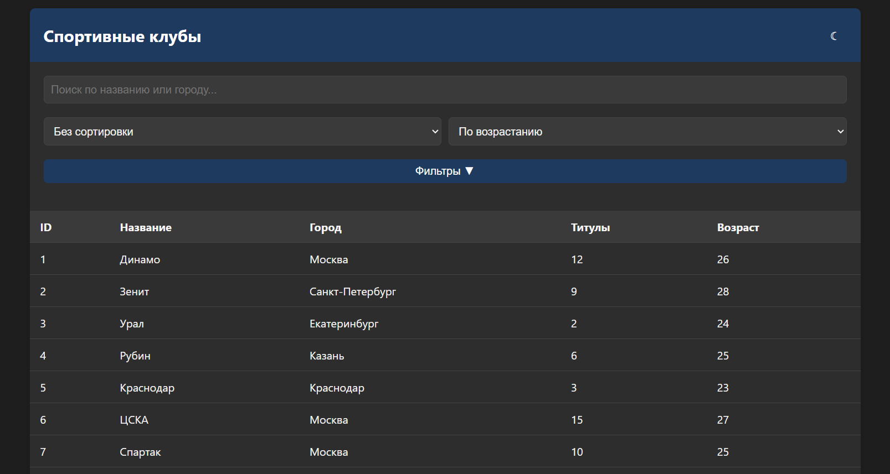

# Программное приложение «Спортивные клубы» 

Это веб-приложение для поиска и фильтрации спортивных клубов, реализованное на Golang с использованием PostgreSQL и HTML/CSS/JavaScript.

## 🛠️ Используемые технологии

- **Golang** — backend
- **Echo** — веб-фреймворк
- **PostgreSQL** — база данных
- **HTML / CSS / JS** — интерфейс
- **GitHub** — хостинг кода

## 💡 Основные функции

- 🔍 Поиск по названию клуба или городу
- 📊 Фильтрация:
  - Титулы: от ... до ...
  - Возраст игроков: от ... до ...
- 📈 Сортировка:
  - По количеству титулов
  - По среднему возрасту
- 🌗 Темная тема (переключается кнопкой)


## 🚀 Как запустить проект

### 1. Установите зависимости

```bash
# Установите Go
sudo apt update
sudo apt install golang-go

# Установите Echo
go get github.com/labstack/echo/v4

# Установите драйвер PostgreSQL
go get github.com/jackc/pgx/v4
```

### 2. Настройте базу данных

```sql
-- Создайте БД и пользователя
sudo -u postgres psql
CREATE DATABASE sports_clubs;
CREATE USER myuser WITH PASSWORD 'mypassword';
GRANT ALL PRIVILEGES ON DATABASE sports_clubs TO myuser;

-- Восстановите структуру из файла demo.sql или выполните руками
```
### 3. Замена данных в db.go

Откройте файл db/db.go и измените строку подключения к своей базе данных:

```
connStr = "user=myuser password=mypassword dbname=sports_clubs sslmode=disable"
```

### 4. Запустите сервер

```bash
cd sports-clubs-api
go run main.go
```

### 5. Откройте интерфейс

Откройте браузер и перейдите по адресу:

```
http://localhost:8080
```

## 📁 Структура проекта

```
sports-clubs-api/
├── main.go
├── go.mod
├── README.md
├── LICENSE
├── public/
│   └── index.html
├── models/
│   └── club.go
├── handlers/
│   └── club_handler.go
└── db/
    └── db.go
```

## 📸 Скриншот



## 🎥 Демонстрация


## 📄 Лицензия

Проект лицензирован под [MIT License](LICENSE).

## 🧑‍💻 Автор

[Dowilt](https://github.com/Dowilt)

